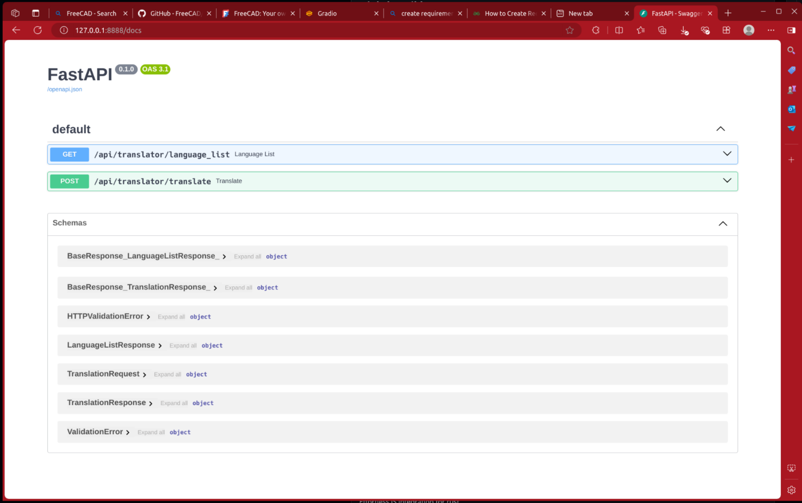

# gradio based simple app and ready-to-use web api with FastApi for [https://github.com/facebookresearch/fairseq]()

### Screenshots:

* Web api:



* Web app


This api and example app uses CUDA by default if available.
there was a wrapper class around huggingface official api named ```my_translator.py``` so you can easly integrate it into your own projects.
 

## How to use it?
it is very simple to use, by default this uses CUDA for the computation backend if available otherwise uses CPU.
* (OPTIONAL) Create a virtual environment with anaconda or venv (venc forexample: ```python3 -m venv ./venv``` and activate the virtual environment with ```source ./venv/bin/activate``` for Linux/macOS and ```. ./venv/bin/Activate.ps1```)
* install the necessary python packages through `pip3 install -r ./requirements.txt`
* (OPTIONAL) all the translation model will be downloaded from huggingface during program startup if the model is not available locally, download of model will fails if you cannot connect (or slow) to huggingface via your network, to solve this problem you can use third-party huggingface mirror, e.g. use [hf-mirror.com]() through:
  * Bash/Zsh (default by Linux/Mac): ```export HF_ENDPOINT=https://hf-mirror.com```
  * PowerShell (default by Windows): ```$env:HF_ENDPOINT = "https://hf-mirror.com"``` (Warning, DON'T USE CMD, USE Powershell or WindowsTerminal with powershell shell engine)
and for more information: [https://hf-mirror.com/](), [huggingface.co]()
* start the app with ```python3 ./translator_app.py``` or rest api with ```python3 ./translator_api.py```

## How to specify which models we wanna use?

in order to use the wrapper you need to initialize the translator class using ```my_translator = Translator("1.3b")```
the literal ```1.3b``` is the simplified model name and all the available values are:  ```"600m", "1.3b", "3.3b", "54b"``` or model name from hugging face e.g. ```facebook/nllb-200-distilled-600M``` or anything else, for further details: please see the source code: ```my_translator.py```